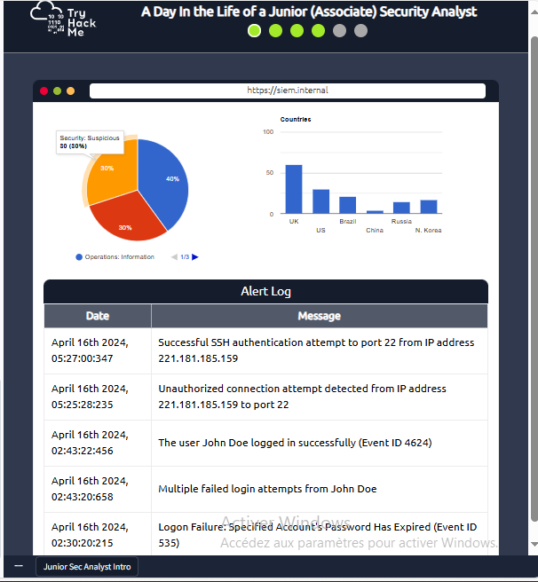
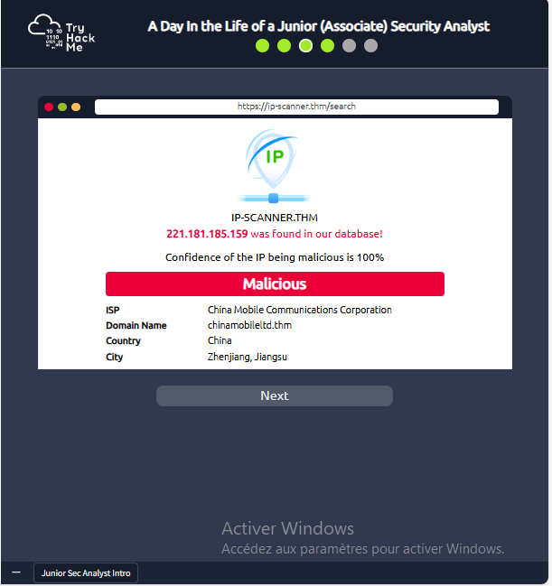
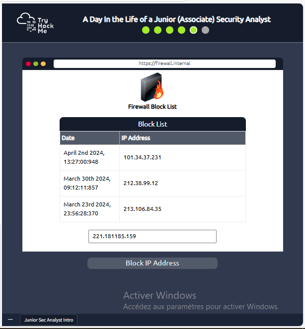

#  SOC Level 1 Certification Path: Junior Security Analyst

##  What is a Junior SOC Analyst?
A **Junior (Associate) Security Analyst** in a **Security Operations Center (SOC)** is responsible for:  
- Monitoring security alerts (SIEM, IDS/IPS).  
- Investigating suspicious activities (malware, phishing).  
- Assisting in incident response.  

> *"You’re the first line of defense against cyber threats!"*  

---

## 📂 **A Day in the Life of a SOC Analyst**  
### **Example: Analyzing a Malicious IP Alert**  
#### **Step 1: Detect the Threat**  
- Alert triggered in **Splunk** (SIEM tool):  
    

#### **Step 2: Investigate the IP**  
- Used **VirusTotal** to confirm malicious activity:  
    

#### **Step 3: Escalate & Block**  
- Escalated to **SOC Manager** (Ticket #4567).  
- Blocked IP on firewall:  
    

#### **Step 4: Attacker's Message**  
After blocking, the hacker left:  
> `"THM{UNTIL-WE-MEET-AGAIN}"`  

---

## 🛠️ Tools & Resources  
- **SIEM**: Splunk, AlienVault  
- **Threat Intel**: VirusTotal, AbuseIPDB  
- **Labs**: [TryHackMe SOC Path](https://tryhackme.com/room/jrsecanalystintrouxo)

---
*© Your Name | [LinkedIn](https://www.linkedin.com/in/nadia-kandoul)*  
